# Phase 2 — Git Workflow & PR Automation

Automated Git branching, pull request validation, and security scanning pipeline built as part of my DevSecOps Engineering portfolio.

This project demonstrates how modern DevSecOps teams integrate security, quality assurance, and governance controls directly into the pull request lifecycle using GitHub Actions, automated testing, and security scanning.


---

# Project Overview

The goal of this repository is to demonstrate secure software delivery practices beyond basic Git usage.

The workflow implements:

* GitFlow branching strategy
* Pull request validation pipelines
* Automated code quality enforcement
* Security scanning automation
* Dependency vulnerability management
* Branch protection and governance controls

This project is part of Phase 2 of my DevSecOps Engineering roadmap focused on CI/CD automation and secure code promotion.


---

# Architecture

```text
Developer
    ↓
Feature Branch
    ↓
Pull Request
    ↓
GitHub Actions
    ├── Ruff Linting
    ├── Pytest
    ├── Build Verification
    ├── TruffleHog
    ├── Bandit
    ├── CodeQL
    ├── pip-audit
    └── Trivy
    ↓
Protected Branch
```

---

# Technologies Used

## Version Control

* Git
* GitHub
* GitFlow Workflow

## CI/CD

* GitHub Actions

## Code Quality

* Ruff
* Pytest

## Security

* Bandit
* CodeQL
* TruffleHog
* pip-audit
* Trivy

## Language

* Python 3

---

# Security Controls Implemented

### Static Application Security Testing (SAST)

* Bandit
* CodeQL

### Secret Detection

* TruffleHog

### Software Composition Analysis (SCA)

* pip-audit

### Filesystem Vulnerability Scanning

* Trivy

### Governance Controls

* Branch Protection Rules
* Pull Request Reviews
* Required Status Checks
* Protected Branches

---

# Branching Strategy

This repository demonstrates GitFlow concepts:

```text
main
 │
 └── develop
        │
        ├── feature/*
        ├── bugfix/*
        ├── hotfix/*
        └── release/*
```

Feature branches are validated through pull requests before promotion into protected branches.

---

# Project Structure

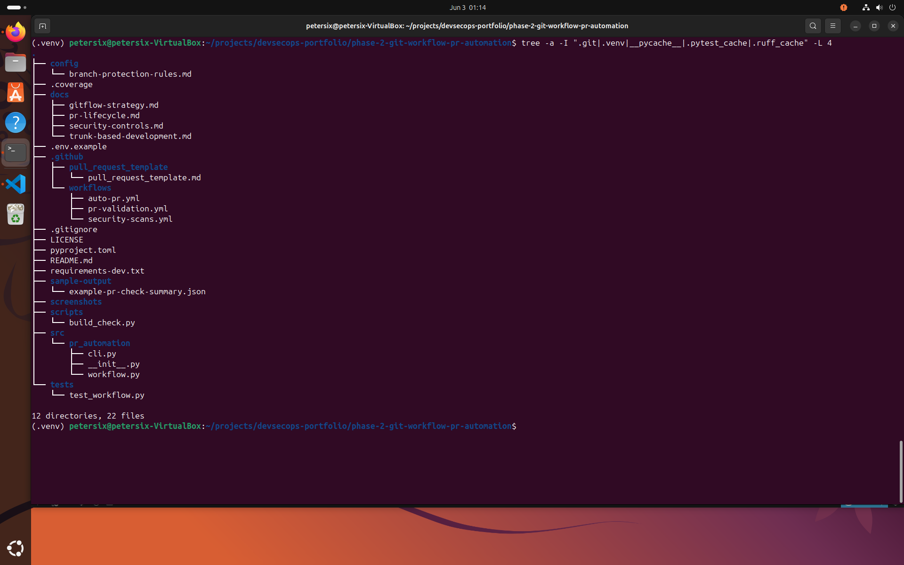

The repository is organized into source code, testing, automation, workflow configuration, documentation, and security validation components.

---

# CI/CD Validation

## Ruff Code Quality Checks

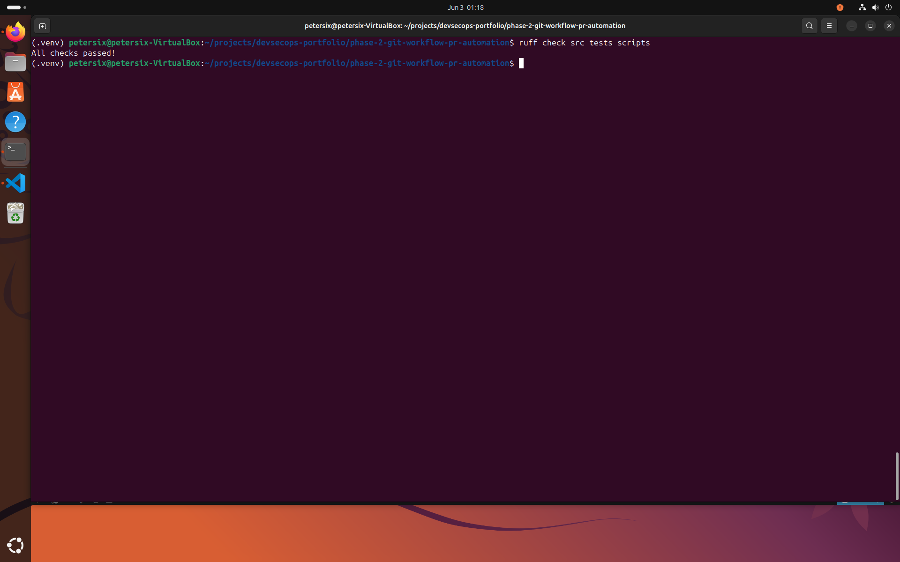

Automated linting ensures code quality and consistency before code promotion.

---

## Pytest Validation

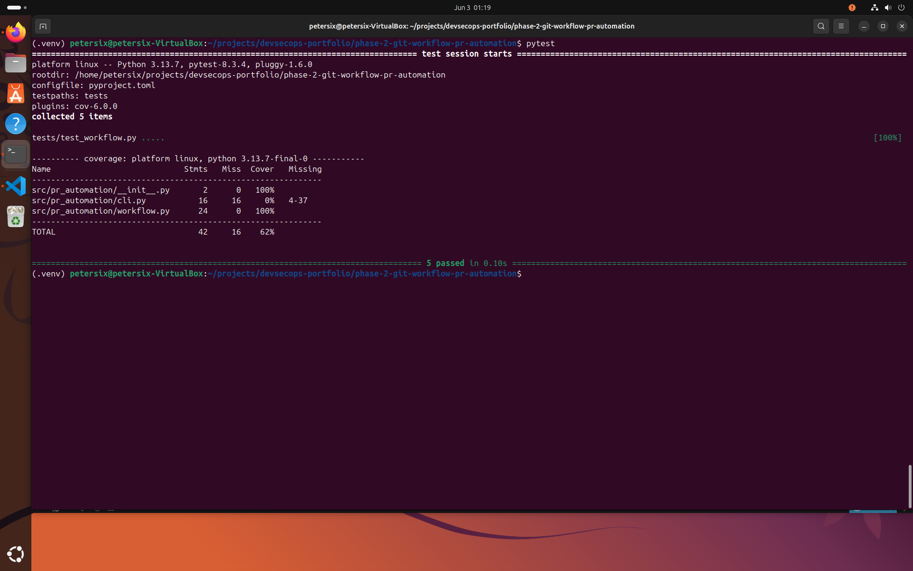

Unit tests validate pull request logic, branch policy enforcement, and merge readiness requirements.

---

## Build Verification


Build validation ensures repository integrity and required project structure.

---

# Security Validation

## Bandit SAST Scan

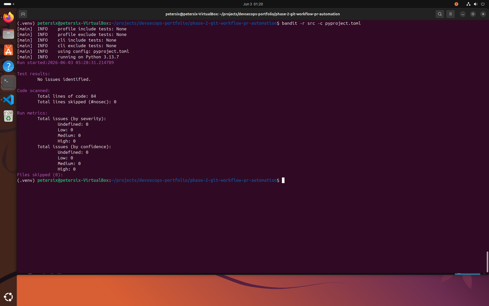

Static analysis identifies insecure coding patterns and security misconfigurations.

---

## GitHub Actions Security Pipeline

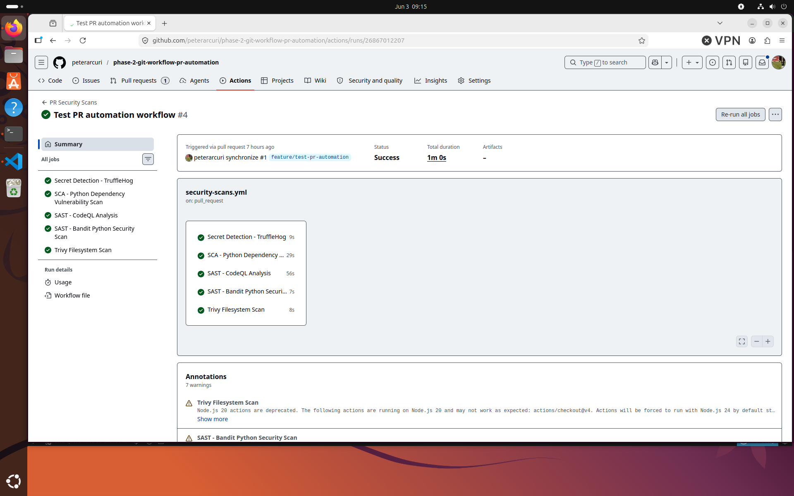

The security pipeline automatically executes:

* TruffleHog
* Bandit
* CodeQL
* pip-audit
* Trivy

during every pull request.

---

# Pull Request Lifecycle

## Pull Request Creation

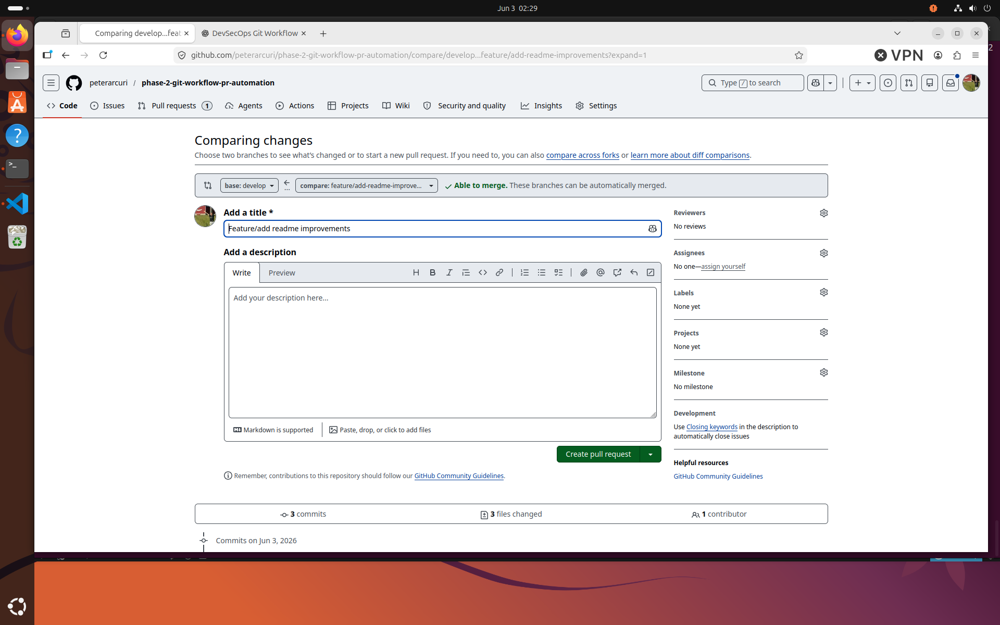

Feature branches are promoted through pull requests for automated validation and review.

---

## Pull Request Validation Running

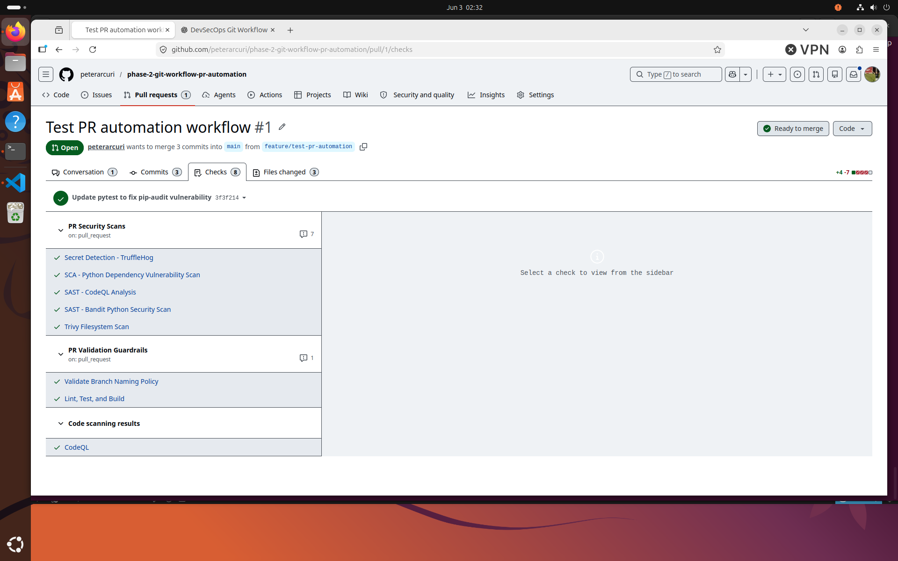

GitHub Actions automatically executes validation and security checks.

---

## Validation Success

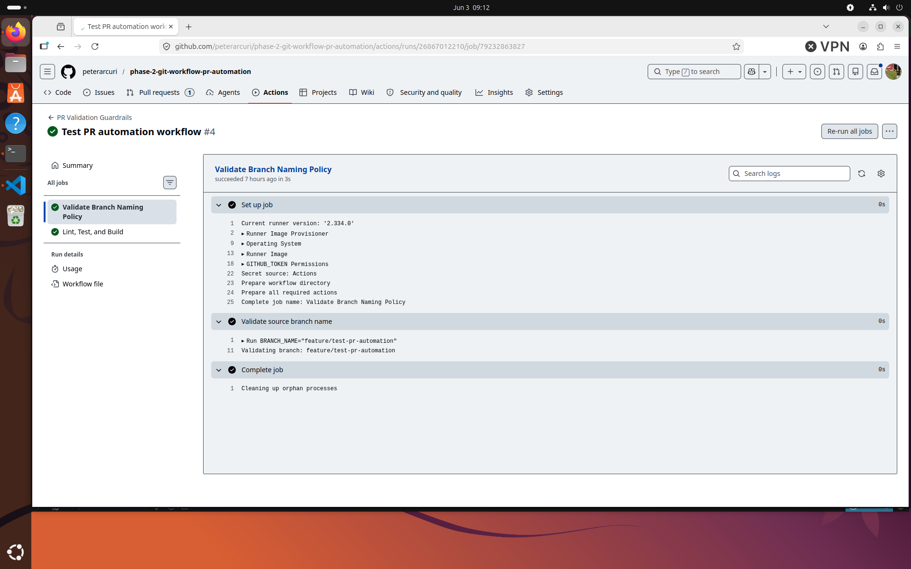

All quality and security controls must pass before merge approval.

---

## Pull Request Ready for Merge

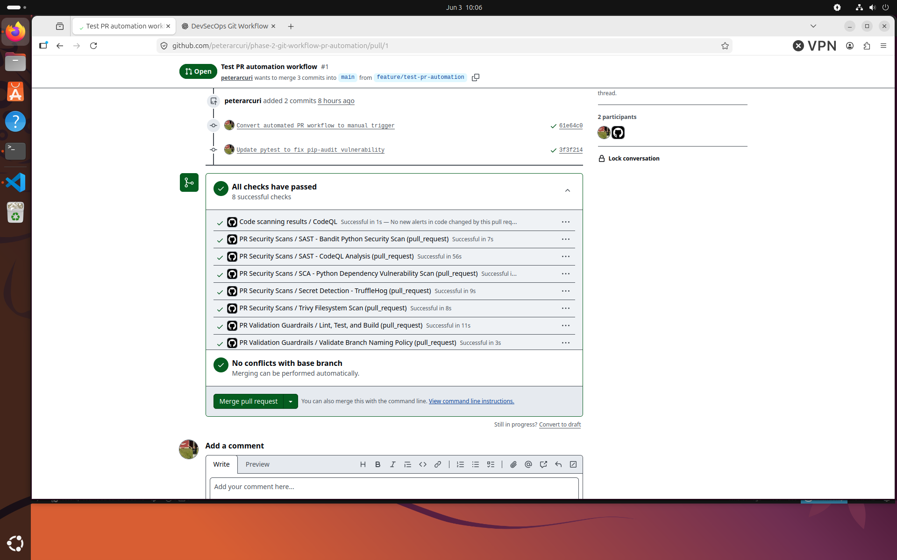

Successful completion of all required checks results in merge eligibility.

---

# Branch Governance

## GitHub Actions Workflows

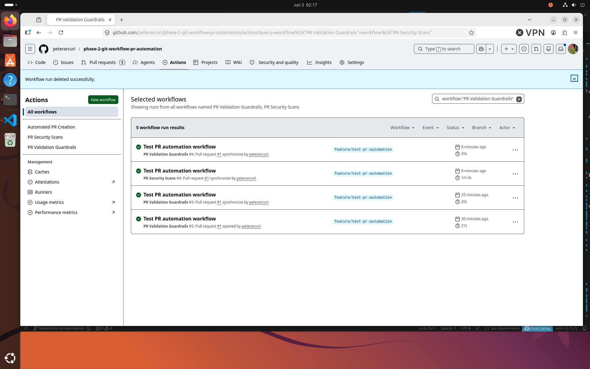

Multiple workflows enforce validation, security scanning, and pull request automation.

---

## Branch Protection Rules

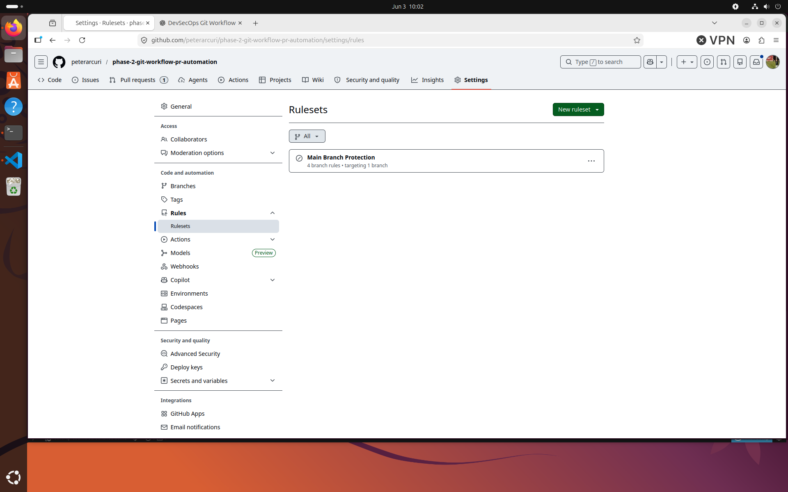

Protected branches enforce:

* Pull request reviews
* Approval requirements
* Required status checks
* Force push prevention
* Branch deletion protection

---

# Skills Demonstrated

* GitFlow Branching Strategy
* Pull Request Automation
* GitHub Actions CI/CD
* Branch Protection Rules
* Static Application Security Testing (SAST)
* Secret Detection
* Software Composition Analysis (SCA)
* Vulnerability Management
* Secure Code Promotion
* Shift-Left Security
* DevSecOps Automation

---

# Results

Successfully implemented a secure pull request workflow that:

* Enforces automated code quality validation
* Executes security scans before merge approval
* Prevents insecure code promotion
* Demonstrates modern DevSecOps CI/CD practices
* Implements governance controls through protected branches

This project provides a practical example of integrating security directly into the software development lifecycle using GitHub Actions and automated DevSecOps controls.


# Screenshots

## Project Structure

Shows the overall repository organization, including GitHub Actions workflows, Python source code, tests, documentation, and security configuration.


---

## Ruff Code Quality Validation

All Ruff linting checks passing successfully.


---

## Pytest Test Suite

All automated unit tests passing successfully.


---

## Build Verification

Repository structure validation and build verification passing successfully.


---

## Bandit Security Scan

Static Application Security Testing (SAST) scan completed with no security findings.


---

## GitHub Actions Workflows

Configured GitHub Actions workflows for pull request validation, security scanning, and PR automation.


---

## Pull Request Creation

Creating a GitFlow-style pull request from a feature branch.


---

## Pull Request Checks Running

Automated CI/CD validation and security checks executing against the pull request.


---

## Pull Request Validation Success

Pull request validation workflow completed successfully.


---

## Security Scan Success

All security controls completed successfully including:

* TruffleHog
* Bandit
* CodeQL
* pip-audit
* Trivy


---

## Branch Protection Ruleset

Repository governance controls protecting critical branches.


---

## Pull Request Ready For Merge

All required checks passed and pull request approved for merge.


